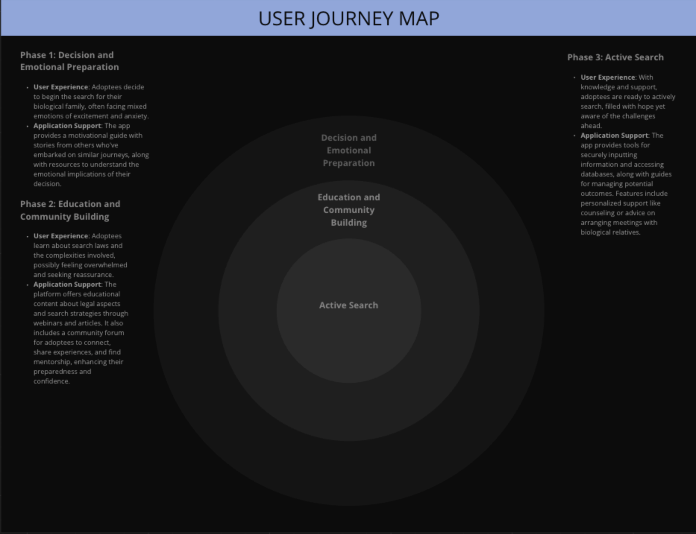

# Project Name

Authors:

- Ahmad Hamza
- Berlineda Faurelus
- Bryan Ramos

Team Name: Family Ties

## 😞 The Problem

Root Link addresses the significant challenges that adoptees and orphans face in reconnecting with their biological families. The existing platforms often fail to prepare users for potential outcomes such as rejection or discovering uncomfortable truths, leading to emotional distress. There are also concerns over privacy and security, as well as the complexity and fragility of relationships that can arise through these connections.

## 📝 Summary

Root Link provides a supportive platform that facilitates the search for biological families, offering both emotional and psychological support. The platform caters to the unique needs of adoptees, helping them navigate the complexities of closed adoption records, legal barriers, and the emotional impact of their search.

## 🤔 Our Hypothesis

If adoptees have access to a supportive online community that offers emotional support, privacy protection, and tailored resources, they will feel more empowered and supported in their search efforts. This empowerment would likely lead to increased engagement in their searches and potentially more successful reunions.

## 📱 Product Overview

Root Link features secure profile creation, fast search and filter tools, a direct messaging system, and a support and resource center. These tools are designed to ensure privacy, ease of use, and comprehensive support, helping users to navigate their journey with confidence and safety.

## 🏙️ Mission Statement

Root Link's mission is to empower adoptees and their biological families to discover and reconnect with each other in a secure, supportive environment. We provide comprehensive search tools, encrypted communication channels, and extensive resources tailored to address the unique challenges faced by individuals separated by adoption.

## 🫂 Who do we serve?

Root Link serves two primary user groups within the adoptee community: adult adoptees looking to learn more about their biological heritage and biological parents or relatives who have relinquished children for adoption and now wish to reconnect.

## 🧳 User Journey Map

## 👥 User-stories

- **User Story A (Registration)**: Users can sign up, input personal information, and set their privacy preferences to tailor the search functionality to their needs.
- **User Story B (Searching for Relatives)**: Users utilize search and filter tools to find potential matches and can view brief profiles of these matches.
- **User Story C (Messaging)**: Secure messaging allows users to communicate directly with potential relatives without sharing personal contact details.
- **User Story D (Interaction and Communication)**: Users can engage with the community by starting discussion threads, posting updates, and commenting on posts within the platform. This interaction allows for shared experiences and support, enriching the user's journey in finding and connecting with biological relatives.

## 🧗‍♂️ Key Technical Challenge

The major technical challenges include ensuring the privacy and security of user data, maintaining the integrity and accuracy of user-provided information, and developing sophisticated matching algorithms to facilitate meaningful connections also fast and effective filter search.

## 🏋🏽 Extension Opportunities

- **Multilingual Support**: To serve a broader global community, adding multilingual support to the platform could help non-English speaking users to access and utilize the platform more effectively. This expansion would cater to a diverse user base, increasing the platform’s inclusively and reach.

- **Mobile Application**: Developing a dedicated mobile app could enhance accessibility and usability, allowing users to engage with the platform on-the-go. This could include push notifications for updates on searches and new community posts, enhancing user engagement and satisfaction.

- **FaceTime Support**: Implementing video calling features such as FaceTime support would allow users to have real-time video interactions with potential family members. This addition would facilitate more personal and emotional connections, providing a valuable tool for users who wish to deepen their interactions and establish stronger bonds before possibly meeting in person.

## 📒 Sources

- [Considering Adoption](https://consideringadoption.com): Provides insights into the emotional and psychological impacts of adoption.
- [Search Angels](https://searchangels.org): Offers guidance on navigating the complexities of searching for biological relatives.
- [Psychology Today](https://www.psychologytoday.com): Discusses the privacy and security concerns in digital interactions and provides expert opinions on managing emotional stress in adoptive reunions.
